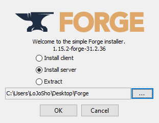

<h1>Setting Up Forge</h1>

### What is Forge?
> 
### Installing Forge
> To begin installing Forge, head over to their [website](http://files.minecraftforge.net/) to download their installer and launch the jar file. Have it open up in an empty directory and hit install server. Have something like the screenshot below.
> 
> 

> After you have installed it, head over to an [SFTP client](https://docs.bloom.host/how-to-use-sftp) such as FileZilla and upload everything inside your folder to your server.

> Next, rename your forge-xxx file to server.jar or go to Startup Parameters and change the Server Jar File.

> Restart your server and let the files generate. This may take a few minutes. 

> A new folder will appear named `mods`. Place any jars of mods you want in here and restart. Make sure you also have the mods if needed. Then, login to the server!

> In the end, it should look like this: 
>
> 

### Installing Forge Mods 
> 
> Refer to [this](forge-mods) guide.

---