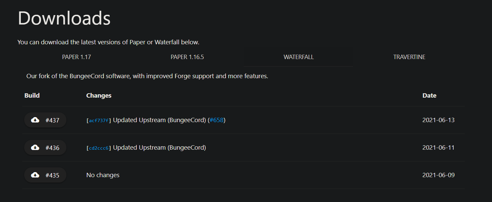
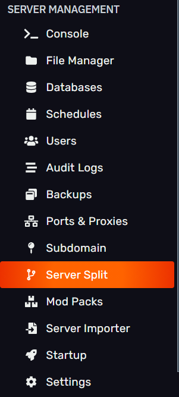
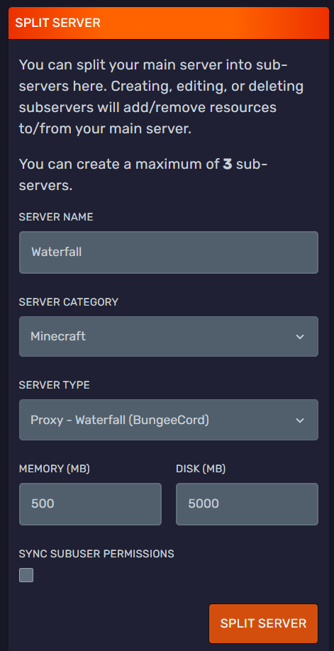

<div class="text--center">

<h1>Setting Up Waterfall</h1>
</div>

:::important
When running your servers behind a proxy like Velocity or Waterfall, it requires them to be set to offline-mode. Normally hosting companies will not provide support for offline mode servers, but in this case it is required for the proxy to function properly. It will act as the gateway to your servers and handle authentication for you.
:::

:::important
We recommend you configure BungeeGuard to secure your backend servers. Follow this [guide](../plugins_and_modifications/plugins/bungeeguard.md) to learn how to configure BungeeGuard.
:::

## Downloading Waterfall

To get started with Waterfall, you need to download their latest jar from their [downloads page](https://papermc.io/downloads#Waterfall).



When you have downloaded their latest jar file, then you can upload it to your waterfall server when it's created on the next step.

## Server split Waterfall server
You can use the Server Split feature that Bloom has developed to create a proxy server on bloom's panel.
You can see in the below image on how you can do so. You need to click on one of your servers to be able to see the server split menu on the left side.



This is how it looks when you're creating your waterfall server in the server split menu.



After you've created the waterfall server in your server split, you'll be able to see the server on your server overview on Bloom's panel.

## Configure Waterfall

*Before you setup this section, change the primary port for your backend servers to something other than 25565. 25565 is the default minecraft port and should be reserved for your Waterfall server as it is what players are actually connecting to when they try and connect to your network.*


You need to start it one time and shut it down afterwards to generate all the files needed to be able to configure waterfall.

Afterwards it will look like this:


We'll configure waterfall in the `config.yml` file. 

This is how a standard waterfall configuration will look like:
```
connection_throttle: 4000
connection_throttle_limit: 3
timeout: 30000
stats: d06cf9e1-441c-441f-8a5b-60a5c6bdccc0
permissions:
  default:
  - bungeecord.command.server
  - bungeecord.command.list
  admin:
  - bungeecord.command.alert
  - bungeecord.command.end
  - bungeecord.command.ip
  - bungeecord.command.reload
network_compression_threshold: 256
servers:
  lobby:
    motd: '&1Just another Waterfall - Forced Host'
    address: localhost:25565
    restricted: false
player_limit: -1
prevent_proxy_connections: false
server_connect_timeout: 5000
remote_ping_timeout: 5000
forge_support: true
remote_ping_cache: -1
log_commands: false
log_pings: true
ip_forward: false
disabled_commands:
- disabledcommandhere
groups:
  md_5:
  - admin
listeners:
- host: 0.0.0.0:25565
  query_port: 25573
  motd: '&1Another Bungee server'
  max_players: 1
  force_default_server: false
  tab_size: 60
  forced_hosts:
    pvp.md-5.net: pvp
  tab_list: GLOBAL_PING
  bind_local_address: true
  ping_passthrough: false
  query_enabled: false
  proxy_protocol: false
  priorities:
  - lobby
online_mode: true
```

You need to have 3 servers in total to be able to use a proxy server. 1 proxy server and 2 backend servers.

We need to add the backend servers to under the servers menu and the priorities list in the `config.yml` file.

If for example, one of your backend servers is a survival server, you'll need to add this under your server section:
```
survival:
    motd: '&1Survival Server'
    address: <survival serverip>:port
    restricted: false
```

Afterwards you'll need to add the survival server to under priorities.

When you're done with adding backend servers it might look like this:
```
connection_throttle: 4000
connection_throttle_limit: 3
timeout: 30000
stats: d06cf9e1-441c-441f-8a5b-60a5c6bdccc0
permissions:
  default:
  - bungeecord.command.server
  - bungeecord.command.list
  admin:
  - bungeecord.command.alert
  - bungeecord.command.end
  - bungeecord.command.ip
  - bungeecord.command.reload
network_compression_threshold: 256
servers:
  lobby:
    motd: '&1Just another Waterfall - Forced Host'
    address: localhost:25565
    restricted: false
  survival:
    motd: '&1Survival Server'
    address: <survival serverip>:port
    restricted: false
  skyblock:
    motd: '&1Skyblock server'
    address: <skyblock serverip>:port
    restricted: false
player_limit: -1
prevent_proxy_connections: false
server_connect_timeout: 5000
remote_ping_timeout: 5000
forge_support: true
remote_ping_cache: -1
log_commands: false
log_pings: true
ip_forward: true
disabled_commands:
- disabledcommandhere
groups:
  md_5:
  - admin
listeners:
- host: 0.0.0.0:25565
  query_port: 25573
  motd: '&1Another Bungee server'
  max_players: 1
  force_default_server: false
  tab_size: 60
  forced_hosts:
    pvp.md-5.net: pvp
  tab_list: GLOBAL_PING
  bind_local_address: true
  ping_passthrough: false
  query_enabled: false
  proxy_protocol: false
  priorities:
  - lobby
  - survival
  - skyblock
online_mode: true
```

:::warning
Make sure `ip_forward` is set to `true` in Waterfall `config.yml` and `bungeecord` is set to `true` in `spigot.yml` on all your backend servers. 
:::

## Configure backend servers

On the backend server, you'll need to go into `server.properties` and set `online-mode` to `false` and afterwards go into `spigot.yml` and change `bungeecord` to `true`.

## Finishing the network setup

After you've done all the tasks, you should start your waterfall server and restart all your backend servers.

